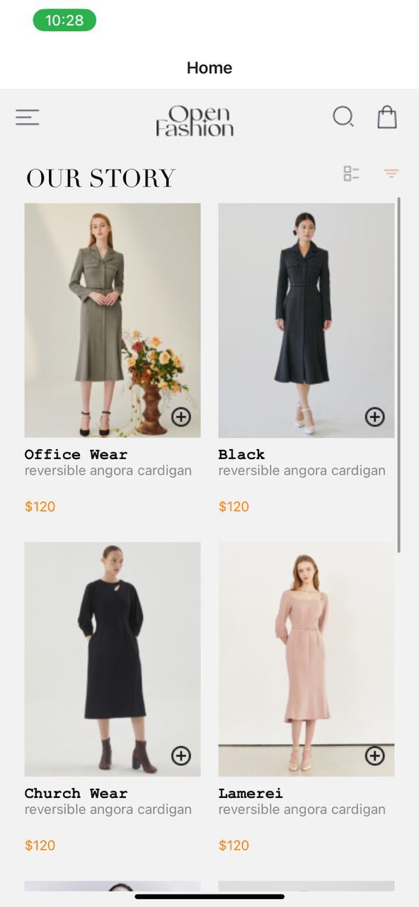
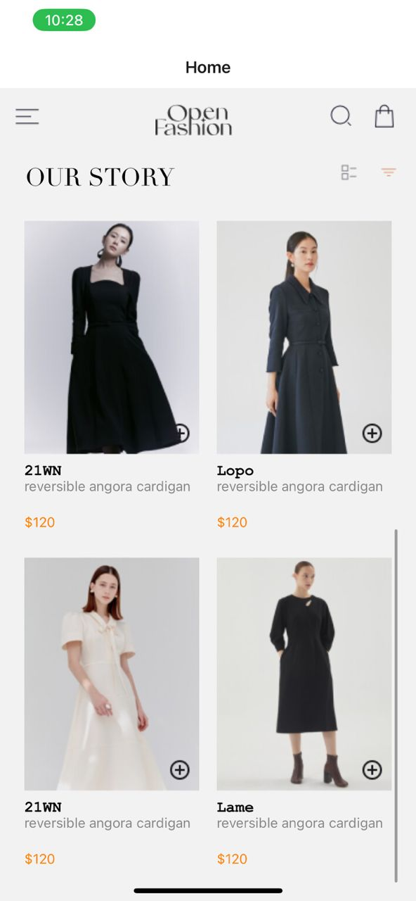
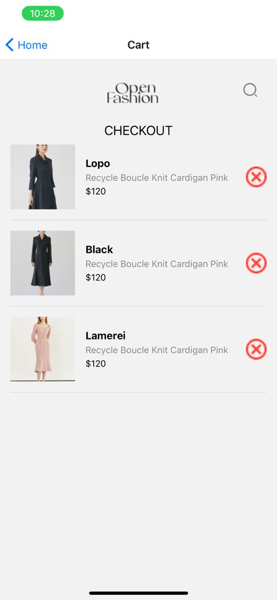

# rn-assignment6-11099255

Design Choices
Navigation: Leveraged React Navigation to implement tab-based navigation between the Home and Cart screens.
State Management: Used React's useState hook to handle the cart state within the application.
Local Storage: Employed AsyncStorage to store cart items locally on the device for persistence.
Implementation
HomeScreen: Shows a list of available products, allowing users to add products to their cart.
CartScreen: Displays the items in the user's cart, with an option for users to remove items.
Local Storage: Utilizes AsyncStorage to keep the cart items stored locally, ensuring data persistence across sessions.

### Screenshots

#### Home Screen

#### Cart Screen

## How to Run

1. Clone the repository.
2. Run `npm install` to install dependencies.
3. Run `expo start` to start the application.
